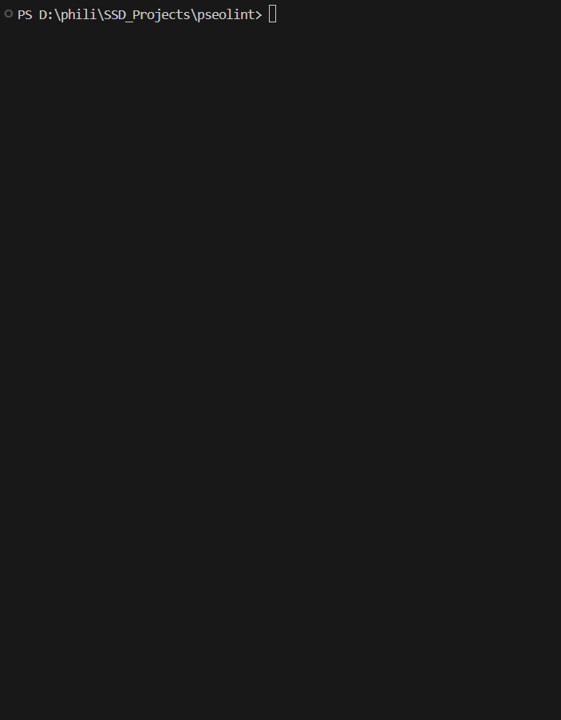

# pSEO Lint

> Audit your pSEO site by template, not by URL.

[](https://www.npmjs.com/package/pseolint)
[](https://www.npmjs.com/package/pseolint)
[](./LICENSE)
[](https://www.npmjs.com/package/pseolint)
[](https://github.com/ouranos-labs/pseolint)
[](https://pseolint.dev/leaderboard)

<p align="center">
  
</p>

The only tool purpose-built for **programmatic SEO compliance**. v0.7 shifts the unit of analysis from URL to template: when you run an audit on a 10,000-URL pSEO directory, pseolint identifies the template clusters (e.g. `/listing/:slug`, `/category/:slug`), samples K pages from each, and produces a per-template verdict + variance metric. Fix one template, fix N pages.

```bash
npx pseolint http://localhost:3000
```

## Why this exists

Programmatic SEO works — when it works. The gap between "1,000 indexed pages" and "1,000 pages that survive a SpamBrain pass" is where most pSEO sites die. The Helpful Content Update made that gap permanent.

Existing SEO tools (Screaming Frog, Sitebulb, Ahrefs Site Audit) were built for editorially-curated sites. They check pages one at a time. But the SpamBrain risks of pSEO are *between* pages: doorway clusters, near-duplicates, entity-swap templates, thin-content propagation. You can't catch them with per-page rules.

pseolint audits the graph — and since v0.6, it groups results by template before surfacing them. Run it before you publish, gate it in CI, fix the broken template before SpamBrain does.

## What's new in v0.6 — audit-as-template

- **Per-template verdict aggregation.** The worst template with ≥5% URL coverage drives the site-level headline. One broken `/listing/:slug` template can no longer hide behind a clean `/category/:slug` template.
- **Per-template variance metric.** Each template reports a `uniformityScore` (how consistently the same problems appear across sampled pages) and a `topDriver` (the rule that fires most across samples). "8/10 samples fail `spam/thin-content`" is a first-class signal, not a buried detail.
- **Two-phase pipeline.** Phase 1 clusters the sitemap into templates (cheap: ~T fetches). Phase 2 runs a deep audit on K pages per template. Typical budget: ~80 fetches on a 100k-URL site vs. 200 in v0.5 — and the 80 cover every template.
- **Backwards compatible.** Per-URL `findings` flat list preserved. `templates` is additive on `AuditResult`.

Design rationale: [docs/superpowers/specs/2026-05-04-pseolint-v0.6-audit-as-template-reframe.md](./docs/superpowers/specs/2026-05-04-pseolint-v0.6-audit-as-template-reframe.md)

## What's new in v0.7 — render-aware checks, AI content-effort, and bring-your-own inputs

### v0.7.3 (current)

- **Render-aware crawl checks.** `--render` (Playwright, Node-only) now feeds two render-diff rules. `tech/csr-bailout` flags pages whose substantive content / interactivity appears only after client-side JS — invisible to crawlers and the first indexing pass. `tech/soft-404` probes one synthetic nonexistent URL per template cluster — an HTTP 200 means the directory will index unbounded junk. Both no-op without `--render` and outside programmatic directories.
- **Bring-your-own authority.** `--authority-score <0-100>` CLI flag, the `authorityScore` config key, the MCP param, or a per-domain Pro-dashboard setting — `>= 80` shifts the verdict one tier lenient, `<= 30` one tier stricter. Raw `risk` unchanged so CI gates stay stable. The engine stays authority-blind by design.
- **AI content-effort signal.** Opt-in `--content-effort` (needs `ANTHROPIC_API_KEY`) — an LLM reads sampled page text and scores 0-100 content originality/effort (cached by content hash), moderating the verdict ±1 tier. Distinct from `--ai` triage. Runs automatically for Pro web audits.
- **MCP rule knowledge as resources** — plus the open knowledge bundle served at `/okf` and linked from `llms.txt`.

### v0.7.2 — graded thresholds + presence-quality

- Four rules moved from binary cliffs to continuous banded severity, so the verdict no longer flips on a one-page crawl-size change: `spam/boilerplate-ratio`, `spam/template-diversity`, `content/value-add`, `content/wikipedia-paraphrase`. Four rules now validate quality, not mere presence: `schema/required-fields`, `schema/json-ld-valid` (accepts `@type` arrays), `tech/og-completeness`, `content/eeat-signals`. `schema/consistency` no longer false-positives on multi-template sites.

### v0.7.1 — false-positive elimination

- `content/unique-value` redesigned from absolute word count to rarity density. **Config change:** `rules.uniqueValueMinWords` → `rules.uniqueValueDensity: { passBelow, errorBelow }`. FP fixes + severity demotions across `links/orphan-pages` & `links/cluster-connectivity` (suppressed on sampled crawls), `tech/canonical-consistency` & `tech/sitemap-completeness` (URL normalization + crawl-scope awareness), and `aeo/crawler-access` (honors robots `Allow` per RFC 9309).

### v0.7.0 — calibration & authority foundations

- Pluggable authority-moderation scaffolding (fail-safe no-op by default), a `checkOriginHealth` pre-flight origin probe (so a crawl can't crush a fragile origin), and an internal score-vs-outcome calibration harness. The web `/limits` page documents the off-page-authority blind spot.

Per-package READMEs ([`@pseolint/core`](packages/core/README.md), [`pseolint`](packages/cli/README.md), [`@pseolint/mcp`](packages/mcp/README.md)) carry the depth.

## How pseolint differs

- **Graph-level, not page-level.** Detects near-duplicate clusters, doorway patterns, and entity-swap doorways across thousands of pages. Per-page tools can't see these.
- **SpamBrain + AI Overview.** 48+ rules across 8 categories — SpamBrain-policy mapping (penalty risk) plus `aeo/*` (AI Overview citability: `llms.txt`, AI-crawler access, citable facts, answer-first, summary-bait).
- **Developer workflow, not SaaS UI.** CLI, GitHub Action, JSON/HTML reports, MCP server, browser extension (SERP competitive recon). Lives in your repo and your PRs.
- **Actionable, not advisory.** Every finding has a fix, an effort tag (`quick fix` / `moderate` / `structural`), and a Google docs reference.
- **Safe for hosted use.** SSRF guard (DNS-validated), robots.txt honoured for our own crawler, analytics-blocking in render mode, `AbortSignal` cancellation, `safeMode: "saas"` preset for embedding in services.
- **Calibrated against reputable pSEO** (v0.5.2). Engine verdicts are calibrated against a curated corpus of in-production pSEO sites that demonstrably win in search. Doorway-pattern findings cluster (no more per-pair noise); verdicts are reproducible at a fixed `sampleSeed`. Dated snapshot results, the open-source corpus, and the trade-offs we accepted live at [pseolint.dev/methodology](https://pseolint.dev/methodology). Spec: [docs/superpowers/specs/2026-05-03-calibration-against-reputable-pseo.md](./docs/superpowers/specs/2026-05-03-calibration-against-reputable-pseo.md).
- **Authority-blind by design, with a manual override.** pseolint analyses static content + the link graph it can see. It does NOT measure backlinks, brand mentions, domain age, or any external trust signal — there is no Moz/Ahrefs/Semrush dependency. This means the engine itself is calibrated for the authority tier of the calibration corpus (established brands). It exposes `authorityScore` (0-100, via the `--authority-score` CLI flag, the core API, or the MCP param) so callers can adjust the verdict ladder for their tier: `>= 80` shifts one tier lenient (established brand can absorb shapes a newer site can't); `<= 30` shifts one tier stricter. Raw `risk` number unchanged so CI gates stay stable. Without the flag, treat verdicts as a directional minimum.
- **Honest about blind spots.** Beyond domain authority, pseolint does not currently detect: Core Web Vitals (LCP/INP/CLS), image SEO (alt-text, dimensions), Open Graph completeness, title-tag uniqueness, H1 structure, schema-content drift (e.g. JSON-LD price ≠ rendered price), outbound-link health, search-intent alignment, parameter-URL crawl-budget waste, and a handful of specialty gaps (mobile-friendliness, cookie-banner detection, AMP/News/Video schema). The complete blind-spot audit lives at [docs/superpowers/specs/2026-05-03-pseolint-blind-spots.md](./docs/superpowers/specs/2026-05-03-pseolint-blind-spots.md) — every gap categorized by impact tier with the roadmap fix.

## What's new in v0.5.2 — credibility layer (v0.7.3 is current)

- **4 new content-quality rules** addressing the v0.5.1 blind-spot audit's tier-1 gaps:
  - `content/title-uniqueness` — empty/missing titles, very-short or excessive-length titles, and pages sharing the exact title (raw, not entity-masked, so catalog templates with per-record entity values still pass).
  - `content/heading-structure` — `<h1>` presence, single-`<h1>` discipline, and `<h2>` sub-structure on long pages.
  - `content/image-alt-text` — `` tags missing `alt` (decorative images marked `role="presentation"` / `aria-hidden="true"` / explicit `alt=""` are skipped).
  - `tech/og-completeness` — the long-promised OG-tag rule that finally ships.
- **`AuditOptions.authorityScore`** (0-100; core API, MCP `audit_site`, or — since v0.7.3 — the `--authority-score` CLI flag) — bring-your-own domain authority. `>= 80` shifts the verdict ladder one tier lenient (established brand can absorb shapes a newer site can't); `<= 30` shifts one tier stricter. Raw `risk` number unchanged so CI gates that key off `--ci-threshold` stay stable. The engine itself remains authority-blind by design — no Moz/Ahrefs/Semrush dependency.
- **Calibration-driven scoring profile** — site-classifier-aware severity demotions for AEO + EEAT rules on catalog/template-driven sites. The `unclear` profile (low classifier confidence) now demotes structurally-incompatible rules conservatively rather than firing them at full strength. Result: reputable pSEO sites no longer false-positive into `concerning`.
- **`spam/doorway-pattern` cluster collapse** — 276 per-pair findings on a heavy-template catalog now collapse to **one** cluster line in the report.
- **`spam/doorway-pattern` content-quality gate** — requires thin-content OR identical-meta as the third signal; structural similarity alone (which all catalogs have) no longer constitutes a doorway finding.
- **Sample-seed determinism** — `AuditOptions.sampleSeed` (mulberry32 PRNG) makes verdicts reproducible across runs for CI gates and calibration.
- **Info-severity bucket cap** — cumulative info contribution caps at 50 per category bucket separately from warning+ at 100. A flood of info findings can no longer tank the verdict on its own.
- **`tech/hreflang-consistency`** — sample-size-aware reciprocity check; defensive parsing.
- **`normalizeAuditUrl` defensive at the source** — single malformed `<link>` no longer aborts an audit.
- **`BackpressureMonitor` thresholds raised** — gate fits real production CDNs (`4×` baseline, `8000ms` p95) instead of tripping on normal load variance.
- **`links/unreachable-from-root` skips on partial-sample audits** — sampling artifact, not real graph isolation.
- **Markdown formatter collapses informational findings** behind `<details>` so PR comments don't drown actionable items in 100+ info bullets.

The full per-round iteration story is in [docs/superpowers/specs/2026-05-03-calibration-against-reputable-pseo.md](./docs/superpowers/specs/2026-05-03-calibration-against-reputable-pseo.md), including a transparent **trade-offs** section documenting what got more lenient (borderline-quality sites that classify as `unclear` may now score one verdict-ladder rung lower than before — `caution → ready` on `wordpress.com` and `expatistan` in the dogfood corpus).

## What's new in v0.3.x

- **AEO rule category (v0.3.0)** — 8 rules that detect AI Overview invisibility: `llms-txt`, `crawler-access` (blocks for GPTBot/ClaudeBot/PerplexityBot/etc.), `freshness-signals`, `faq-coverage`, `answer-first`, `citable-facts`, `content-modularity`, `summary-bait`. Scoring re-weighted; new `AEO: AI Overview Readiness` console section.
- **Render-mode analytics blocking (v0.3.1)** — rendered audits previously fired every GA/Plausible/PostHog/Mixpanel/Hotjar/Sentry beacon on every page. Now blocks ~40 analytics hosts by default. `--analytics` / `--block-host` flags, `allow-first-party` option.
- **SSRF guard + AbortSignal + robots honour (v0.3.2)** — DNS-validated private-range check on every fetched URL, integer/hex-IP bypass protection, redirect re-validation, honoured target `robots.txt` Disallow directives (with UA-specific parsing), clean `ctrl-C` / programmatic cancel via `AbortSignal`, new public API: `validateTargetHost`, `SSRFError`, `DnsResolutionError`.
- **`safeMode` preset + `safeFetch` (v0.3.3)** — one-knob safety posture for hosts. `safeMode: "saas"` flips guardSsrf + tightens caps + keeps robots honour on; `safeMode: "cli"` keeps local-friendly defaults. `safeFetch(url)` is an SSRF-safe fetch for non-audit use cases. `maxCrawlDiscovered` ceiling caps link-discovery fan-out. `followRedirects: false` option.
- **Diff-mode audits (v0.3.0)** — `mode: "diff"` skips corpus-scoped rules so daily re-audits of changed pages don't re-run clustering / link-graph / sitemap checks.

See [CHANGELOG.md](./CHANGELOG.md) for the full list.

## Quick Start

```bash
# Point it at your local dev server — that's it
npx pseolint http://localhost:3000
```

Automatically discovers all pages by following internal links. No sitemap, no config, no build step needed.

```bash
# Save a visual report
npx pseolint http://localhost:3000 --format html --output report.html

# Audit a live site (per-template output is the default)
npx pseolint https://yoursite.com

# CI gate on build output
npx pseolint ./out --ci-threshold concerning --format json
```

### Per-template output (v0.6 default)

```
Verdict: CONCERNING
Integrity C · Discoverability B · Citation C · Data A

Per-template breakdown (3 templates):

  /listing/:slug  CONCERNING  C
  10/8201 URLs (0.1%)  uniformity 85%
  8/10 samples fail `spam/thin-content`

  /category/:slug  READY  A
  10/312 URLs (3.2%)  uniformity 94%

  /help/:slug  CAUTION  B
  10/47 URLs (21.3%)  uniformity 78%
  3/10 samples fail `content/missing-author`
```

`--format json` includes the `templates` array alongside the existing `findings` list:

```json
{
  "verdict": "concerning",
  "risk": 60,
  "templates": [
    {
      "signature": "/listing/:slug",
      "totalUrls": 8201,
      "auditedUrls": ["https://example.com/listing/foo", "..."],
      "verdict": "concerning",
      "risk": 60,
      "variance": {
        "uniformityScore": 0.85,
        "topDriver": { "ruleId": "spam/thin-content", "fireRate": 0.8 }
      }
    },
    { "signature": "/category/:slug", "verdict": "ready", "risk": 12 }
  ],
  "findings": [...]
}
```

Use `--legacy-flat` to suppress the template cards and get the v0.5-style flat findings list.

### Partial coverage (`truncated`)

If the crawl is interrupted — e.g. the backpressure watchdog aborts because the origin is degrading — pseolint still emits whatever it collected, flagged as partial:

```json
{
  "verdict": "ready",
  "risk": 12,
  "truncated": true,
  "truncatedReason": "Origin degraded mid-crawl (p95 latency exceeded threshold)",
  "pageCount": 42
}
```

When `truncated` is `true`, **treat `pageCount`, `risk`, and `verdict` as lower bounds** — a partial pass is not a full pass. The CLI prints a `PARTIAL REPORT` banner and exits non-zero; the GitHub Action warns (and can fail with `fail-on-truncated: true`); the MCP tools and web report surface the same flag. Programmatic consumers should branch on it. The full output contract is published as a JSON Schema (`packages/core/schemas/audit-summary.schema.json`, `$id` carries the `schemaVersion`).

## Audit Modes

| Mode | Command | What you get |
|------|---------|-------------|
| **Local dev server** | `npx pseolint http://localhost:3000` | Full rendered pages, HTTP headers, redirect detection, crawl discovery. **Best results.** |
| **Live site** | `npx pseolint https://yoursite.com` | Same as above against production. Slower (network latency). |
| **Build directory** | `npx pseolint ./out` | Static HTML files only. No HTTP headers, no redirect detection, no soft-404 detection, no sitemap comparison. Use for CI gates. |

> **Why localhost is recommended:** Build directories contain framework artifacts (Next.js `[slug].html` shells, empty client-rendered pages) that produce false positives. Your dev server renders the actual pages Google will see — with canonicals, meta tags, and full content.

## What It Checks

**44 rules** across **8 categories** (all 8 scored), producing a weighted **SpamBrain Risk Score** (0-100) and an independent **AEO sub-score** for AI Overview citability:

### SpamBrain Risk Detection

| Rule | What It Checks | Severity |
|------|---------------|----------|
| `spam/near-duplicate` | SimHash similarity between all page pairs (>85%) | Critical |
| `spam/entity-swap` | Doorway pages where only a proper noun changes | Critical |
| `spam/doorway-pattern` | Composite: entity-swap + thin + identical structure + same meta | Critical |
| `spam/thin-content` | Pages below 300 words (excluding nav/header/footer) | Error |
| `spam/boilerplate-ratio` | Pages with >70% shared template content | Error |
| `spam/template-diversity` | Identical DOM structure across all pages | Warning |
| `spam/publication-velocity` | >100 pages sharing the same publish date | Warning |
| `spam/template-coverage` | Template dimension coverage (e.g. 87 of 960 possible combinations) | Info |

### Content Quality

| Rule | What It Checks | Severity |
|------|---------------|----------|
| `content/unique-value` | Each page must have 100+ words not found on any other page | Error |
| `content/meta-uniqueness` | Meta descriptions identical after entity masking | Error |
| `content/title-uniqueness` | Empty/missing title, very short or excessively long title, or two pages sharing the exact title (raw, not entity-masked — catalog templates with per-record entity values pass) | Error / Warning / Info |
| `content/heading-structure` | No `<h1>`, multiple `<h1>` elements, or long pages (>600 words) with no `<h2>` sub-headings | Error / Warning / Info |
| `content/image-alt-text` | `` tags missing `alt` attribute (decorative images marked `role="presentation"` / `aria-hidden="true"` / `alt=""` are skipped) | Warning / Info |
| `content/missing-author` | No author schema, meta, byline, or rel="author" | Warning |
| `content/eeat-signals` | Missing E-E-A-T signals (author, dates, sources, about links) | Info |

### Internal Linking

| Rule | What It Checks | Severity |
|------|---------------|----------|
| `links/orphan-pages` | Pages with zero inbound internal links | Error |
| `links/host-section-divergence` | Sub-sections (e.g. `/coupons/`, `/deals/`) that diverge from the rest of the host on ≥2 of: cross-section inbound links, topic vocabulary, template signature, authorship coverage. Targets Google's May 2024 site-reputation-abuse policy. | Warning / Error |
| `links/dead-ends` | Pages with zero outbound internal links | Warning |
| `links/cluster-connectivity` | Isolated page clusters with no cross-linking | Warning |
| `links/unreachable-from-root` | Pages with no path from the start URL (graph-disconnected from the entry point) | Warning |
| `links/link-depth` | Pages requiring >3 clicks from root | Info |

### Technical SEO

| Rule | What It Checks | Severity |
|------|---------------|----------|
| `tech/canonical-consistency` | Missing, invalid, or conflicting canonical URLs (HTML + HTTP header) | Error |
| `tech/sitemap-completeness` | Pages missing from sitemap, phantom 404s, redirecting sitemap URLs | Error |
| `tech/csr-bailout` | Render-diff: substantive content / interactivity that appears only after client-side JS — invisible to crawlers and the first indexing pass (needs `--render`) | Warning |
| `tech/soft-404` | HTTP 200 pages that look like error pages — plus a synthetic-URL probe that fetches one nonexistent URL per template cluster (a 200 means the directory will index unbounded junk; needs `--render`) | Error |
| `tech/robots-compliance` | Sitemap URLs blocked by `robots.txt` (Disallow patterns matching listed pages) | Error |
| `tech/robots-noindex-conflict` | Noindexed pages (meta or X-Robots-Tag) with inbound links | Warning |
| `tech/canonical-noindex-conflict` | Noindex + canonical pointing elsewhere | Warning |
| `tech/redirect-chain` | Redirect chains longer than 2 hops | Warning |
| `tech/hreflang-consistency` | Hreflang reciprocity (A->B requires B->A) | Warning |
| `tech/og-completeness` | Missing `og:title`, `og:description`, or `og:image` — affects social-share previews and AI Overview fallback summaries | Warning |
| `tech/robots-sitemap-presence` | Missing or unreachable `/robots.txt` or `/sitemap.xml` at the origin | Warning |

### Data Consistency

| Rule | What It Checks | Severity |
|------|---------------|----------|
| `data/missing-binding` | When `--data-source` is set, flags fields from the source record that don't appear on the matching page (e.g. FAQ items, regulation clauses listed in the source JSON but missing from rendered HTML) | Warning |
| `data/identical-across-pages` | Source-data fields that differ in the JSON but render identically across pages (suggests a missing binding loop or a hardcoded template value) | Warning |

### Structured Data

| Rule | What It Checks | Severity |
|------|---------------|----------|
| `schema/json-ld-valid` | Malformed JSON-LD, missing @context or @type | Error |
| `schema/required-fields` | Article/Product/FAQ missing required fields | Warning |
| `schema/consistency` | Mixed schema types across template pages | Info |

### Cannibalization

| Rule | What It Checks | Severity |
|------|---------------|----------|
| `cannibal/url-pattern` | URL structures with same tokens in different order | Info |

> `cannibal/title-overlap` and `cannibal/keyword-collision` were dropped in v0.4 due to high false-positive rates on legitimately similar pages (e.g. localized variants, paginated archives). See the [v0.4 redesign spec §4.3](./docs/superpowers/specs/2026-04-29-pseolint-v0.4-engine-redesign.md).

### AEO — AI Overview Readiness (v0.3.x)

| Rule | What It Checks | Severity |
|------|---------------|----------|
| `aeo/llms-txt` | `/llms.txt` missing or malformed at the origin | Warning |
| `aeo/crawler-access` | `robots.txt` blocks `GPTBot` / `ClaudeBot` / `PerplexityBot` / `Bytespider` / `Google-Extended` / `CCBot` / `Applebot-Extended` / `ChatGPT-User` | Warning / Error |
| `aeo/freshness-signals` | No `dateModified` / modification meta / visible "Last updated" | Warning |
| `aeo/faq-coverage` | FAQ-style content (question-phrased H2s) without `FAQPage` / `HowTo` JSON-LD | Info |
| `aeo/answer-first` | First paragraph after H1 is boilerplate or lacks facts / named entities | Error |
| `aeo/citable-facts` | <3 entity-specific citable facts per page after template-fact filtering | Error |
| `aeo/content-modularity` | Sections that cross-reference each other or use vague headings — not independently extractable | Warning |
| `aeo/summary-bait` | Composite: strong opener + no interactive value + facts packed in opener → guaranteed zero-click loss | Error |

## Live URL Scanning

When you point pseolint at a URL, it captures what Google sees:

- **HTTP metadata** — status codes, redirect chains, X-Robots-Tag, Link headers
- **Crawl discovery** — follows internal links from the start page to find all crawlable pages
- **Sitemap comparison** — if a sitemap exists, compares it against crawl-discovered pages

```bash
# Just give it your homepage — it discovers everything
npx pseolint https://paperforge.dev
```

## Page Groups

Different page types need different standards. Configure groups in `pseolint.config.ts`:

```typescript
export default {
  pageGroups: {
    pseo: {
      match: '/templates/**',
      rules: ['spam/*', 'content/*', 'links/*', 'cannibal/*', 'tech/*', 'schema/*'],
      overrides: {
        'spam/thin-content': { thinContentMinWords: 500 },
      }
    },
    listing: {
      match: ['/documents', '/templates'],
      rules: ['tech/*'],
    },
    marketing: {
      match: ['/', '/about', '/pricing'],
      rules: ['tech/*'],
    },
    utility: {
      match: ['**/404*', '**/500*'],
      rules: [],  // skip entirely
    }
  }
};
```

Each group gets its own score. Unmatched pages get all rules.

## SpamBrain Risk Score

The risk score (0–100) aggregates rule penalties into **4 super-categories** — **Integrity** (spam + content + cannibal), **Discoverability** (links + tech), **Citation** (aeo + schema), and **Data** — with site-type-aware weights, so a programmatic directory and a docs site are each scored against the rule weighting that matches their archetype. Since v0.6, scoring runs **per template** and rolls up to a site verdict: the worst-scoring template that covers ≥5% of the audited URLs.

The score maps to a 4-rung **verdict ladder**, and CI gates on the verdict (`--ci-threshold`, default `concerning`) — not a raw numeric band:

| Verdict | Meaning | CI exit (verdict ≥ threshold) |
|---------|---------|-------------------------------|
| `ready` | no material risk | 0 |
| `caution` | minor issues | 0 |
| `concerning` | likely penalty-pattern exposure | 1 |
| `critical` | strong penalty-pattern exposure | 1 |

See [pseolint.dev/methodology](https://pseolint.dev/methodology) for the calibrated weights and verdict thresholds.

## Actionable Output

Findings are automatically enriched before display:

- **Pairwise clustering** — Thousands of near-duplicate pair comparisons collapse into a handful of cluster findings: "48 pages form a near-duplicate cluster (86–94% similar)."
- **Content breakdown** — Each cluster shows what's shared vs. unique: "Shared: description of property (31w), buyer acknowledges (35w). Unique: 3324w of 8140w."
- **Effort tags** — Every finding is tagged `quick fix`, `moderate`, or `structural` so you know where to start.
- **Template detection** — When the tool detects template-generated content, fix suggestions speak to template authors: "Add conditional content sections per entity."

## CLI Options

```
Usage: pseolint [options] [command] [source]

Arguments:
  source                         URL or directory path to audit

Output
  -f, --format <type>            Output format: console | json | markdown | html (default: console)
  --ci-threshold <severity>      Min verdict that fails CI: ready|caution|concerning|critical (default: concerning)
  -t, --threshold <n>            [deprecated] Numeric risk threshold; use --ci-threshold instead
  -o, --output <file>            Write report to file instead of stdout
  --no-color                     Disable colored output

Crawl / fetch
  --concurrency <n>              Max parallel HTTP fetches (default: 5)
  --timeout <ms>                 Per-request timeout in ms (default: 30000)
  --no-crawl                     Disable crawl-based page discovery for URL sources
  --ignore <patterns>            Comma-separated glob patterns to exclude
  --render                       Render pages in a browser before auditing
  --browser-ws <url>             CDP WebSocket endpoint for browser rendering

Sampling
  --sample-size <n>              Audit N pages (default: 0 = all)
  --strategy <random|stratified> Sampling strategy (default: stratified)
  --max-per-template <n>         Cap samples per URL template cluster (default: 0)

Template output (v0.6)
  --per-template                 Render per-template cards above the findings list (default: ON)
  --template <signature>         Filter output to a single template, e.g. /listing/:slug
  --legacy-flat                  Suppress template cards; print the v0.5-style flat findings list

Cache & monitoring
  --cache [dir]                  Enable HTTP cache (default: .pseolint/cache)
  --cache-ttl <duration>         TTL for entries without validators, e.g. 7d, 1h, 30m (default: 7d)
  --state [path]                 Enable state persistence (default: .pseolint/state.json)
  --mode <monitoring|fresh>      v0.5+ change-driven monitoring mode. Auto-monitoring is the
                                 default when prior state exists. Use 'fresh' to force a full
                                 re-audit even with prior state.
  --age-floor-days <n>           v0.5+ minimum days since a URL's last fetch before monitoring
                                 forces a re-fetch regardless of other signals (default: 7)
  --since                        v0.5+ alias for --mode=monitoring (kept for back-compat)
  --exit-on-regression           Exit non-zero when new rule IDs fire vs prior --state

Data
  --data-source <file>           JSON file with source data for content-verification rules

AI triage (opt-in)
  --ai                           Enable AI triage of findings
  --ai-provider <id>             anthropic | openai | google | mistral | groq | xai | cohere | ollama
  --ai-model <name>              Model name (overrides provider default)
  --ai-endpoint <url>            AI endpoint (Ollama only; default: http://localhost:11434)
  --ai-max-tokens <n>            Input token cap per triage call (default: 60000)
  --ai-max-cost <usd>            Refuse a triage call whose pre-flight cost exceeds this USD
  --ai-daily-budget <usd>        Refuse triage when today's total spend would exceed USD (requires --telemetry)
  --ai-cache-ttl <duration>      Triage cache TTL, e.g. 30d, 12h, 60s (default: 30d)
  --no-ai-cache                  Bypass AI triage cache for this run
  --no-ai-suggest                Suppress AI discovery hint in non-AI runs

Telemetry (local, offline)
  --telemetry                    Enable local telemetry write (.pseolint/telemetry.jsonl)
  --telemetry-path <file>        Override telemetry JSONL path
  --no-telemetry-prompt          Suppress the y/n/skip triage feedback prompt
  --triage-feedback <rating>     Non-interactive feedback: helpful | unhelpful | y | n

MCP
  --mcp                          Start as an MCP server (for AI coding assistants)

Commands:
  stats                          Show aggregate telemetry stats from .pseolint/telemetry.jsonl
  stats-export <outPath>         Copy telemetry JSONL to <outPath> for manual review/sharing
```

### Caching & change-driven monitoring (v0.5)

```bash
# First run: populates .pseolint/cache and .pseolint/state.json with full baseline
npx pseolint https://yoursite.com --cache --state

# Subsequent runs auto-enter monitoring mode. The decision matrix decides which
# URLs to fetch BEFORE the network round-trip:
#   - new URL                         → fetch (reason: new)
#   - prior fetch ≥ 7 days old        → fetch (reason: age)
#   - ruleset version bumped          → fetch (reason: ruleset)
#   - prior warning/error finding     → fetch (reason: recheck) — info findings carry forward
#   - sitemap <lastmod> newer         → fetch (reason: lastmod)
#   - none of the above + lastmod present → SKIP (carry findings forward)
npx pseolint https://yoursite.com --cache --state

# Force a full re-audit even with prior state
npx pseolint https://yoursite.com --cache --state --mode=fresh

# Lower the age-floor for tighter monitoring (default: 7 days)
npx pseolint https://yoursite.com --cache --state --age-floor-days=3

# CI gate that fails when a *new* rule ID starts firing on actually-fetched URLs
npx pseolint https://yoursite.com --cache --state --exit-on-regression
```

Sites whose sitemaps emit `<lastmod>` (Next.js, Yoast/WordPress, Astro) get the
biggest savings — typically ~95% fewer fetches on steady-state monitoring runs.
Sites without `<lastmod>` hit `no-signal` and refetch every URL; bandwidth is
still saved via cache.ts conditional GETs but round-trips aren't skipped (a
HEAD-fallback path is on the roadmap).

End-of-run summary line:
```
Monitoring: 47/4012 URLs re-scraped (recheck=23, lastmod=12, age=8, new=4), 3965 carried forward.
```

### AI triage

Turns hundreds of findings into a handful of ranked root causes. Opt-in, bring-your-own API key, with cost guardrails:

```bash
# Auto-detect provider from env (ANTHROPIC_API_KEY, OPENAI_API_KEY, etc.)
npx pseolint https://yoursite.com --ai

# Pin provider + model, cap spend
npx pseolint https://yoursite.com --ai \
  --ai-provider anthropic \
  --ai-model claude-haiku-4-5 \
  --ai-max-cost 0.50

# Local-only (Ollama, no network cost)
npx pseolint https://yoursite.com --ai --ai-provider ollama --ai-model qwen2.5:7b

# Enforce a daily spend ceiling across runs (requires telemetry)
npx pseolint https://yoursite.com --ai --telemetry --ai-daily-budget 5.00
```

Every call prints a pre-flight cost estimate before hitting the provider. Cache hits don't count against the daily budget.

### Local telemetry & stats

Telemetry is **local JSONL only** — zero network, counts + spend + feedback ratings. Off by default.

```bash
npx pseolint https://yoursite.com --ai --telemetry
npx pseolint stats              # show your success rate, spend, feedback ratio
npx pseolint stats-export out.jsonl  # copy log for manual inspection
```

## Browser Rendering

For client-rendered sites (React SPAs, Next.js app router), use `--render` to capture the fully rendered DOM:

```bash
# With a remote CDP endpoint (Browserless, etc.)
PSEOLINT_BROWSER_WS=wss://your-browser:3000 npx pseolint https://yoursite.com --render

# With local Playwright
npm install playwright-core
npx playwright install chromium
npx pseolint https://yoursite.com --render
```

Works with any CDP-compatible browser. Remote endpoints must use `wss://`.

## GitHub Action

```yaml
name: pSEO Lint
on: [pull_request]

jobs:
  audit:
    runs-on: ubuntu-latest
    steps:
      - uses: actions/checkout@v4
      - uses: actions/setup-node@v4
        with: { node-version: '20' }
      - run: npm run build
      - uses: ouranos-labs/pseolint@action-v1
        with:
          source: ./out
          threshold: 40
```

Posts a score summary as a PR comment and fails the check if score exceeds the threshold.

## Output Formats

```bash
npx pseolint https://yoursite.com                  # Colored terminal (default)
npx pseolint https://yoursite.com --format json    # CI-friendly JSON
npx pseolint https://yoursite.com --format markdown # PR comments / docs
npx pseolint https://yoursite.com --format html    # Self-contained visual report
```

## Monorepo

| Package | npm | Version | License |
|---------|-----|---------|---------|
| `packages/core` | [`@pseolint/core`](packages/core/README.md) | 0.7.0 | MIT |
| `packages/cli` | [`pseolint`](packages/cli/README.md) | 0.7.0 | MIT |
| `packages/mcp` | [`@pseolint/mcp`](packages/mcp/README.md) | 0.7.0 | MIT |
| `packages/action` | GitHub Action (`ouranos-labs/pseolint@action-v1`) | — | MIT |
| `apps/web` | pseolint.dev | — | AGPL-3.0 |

## Development

```bash
bun install
bun run build
bun run test     # 1,203 tests across 126 files (core)
```

## License

MIT (packages) / AGPL-3.0 (apps/web)
