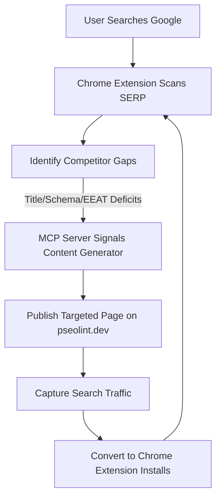

# Programmatic SEO & SERP Content Insertion Strategy
## Executive Strategy Report for pseolint.dev
### Refined & Exhaustive Version (Iteration 3)

This document establishes our exhaustive, data-driven content insertion strategy for **pseolint.dev**. By utilizing our Chrome Extension and MCP server architecture, we will audit competitor search results, identify optimization deficits (metadata, structured data, E-E-A-T, thin content), and launch targeted comparison layouts, interactive diagnostic guides, and programmatic developer rulebooks to systematically capture high-intent search traffic.

---

## 1. The Browser Extension Moat: Strategy Overview

Traditional SEO tools focus on auditing a customer's *own* website. **pseolint.dev's unique advantage (our moat)** is to audit **competitors directly inside the search engine results page (SERP)**. 

By running audits on ranking competitor pages at the moment of search, we create a closed-loop acquisition engine:
1. **Detect Gap**: Locate ranking pages that fail structured data, suffer title rewrites, or have ignored snippets.
2. **Construct Insertion**: Generate programmatic landing pages that solve those exact gaps (perfect schema, optimized titles, E-E-A-T trust signals).
3. **Capture Traffic**: Outrank competitors for long-tail queries and convert search visitors into active users of the **pseolint** SaaS platform and Chrome Extension.



---

## 2. Competitive SERP Audit Matrix

Using our simulated extension rules engine on target programmatic SEO search terms, we have mapped the optimization gaps of current ranking competitors:

| Competitor Page | Target Query | Word Count | Schema.org? | Title Rewrite? | Meta Description Status | Primary Gaps & Weaknesses |
| :--- | :--- | :--- | :--- | :--- | :--- | :--- |
| [byword.ai](https://byword.ai) | `programmatic seo tool` | ~350w (thin) | ❌ No | ⚠️ Yes | ⚠️ Ignored by Google | `thin content, title rewritten, meta desc ignored, no schema, missing dateModified` |
| [seomatic.ai](https://seomatic.ai) | `programmatic seo tool` | 1,438w | ✅ Yes | ⚠️ Yes | ⚠️ Ignored by Google | `no Author, no Date, title rewritten, meta desc ignored, generic template language` |
| [thestacc.com](https://thestacc.com) | `programmatic seo tool` | 2,176w | ✅ Yes | ⚠️ Yes | ⚠️ Ignored by Google | `no Date, title rewritten, meta desc ignored, shallow comparison table` |
| [joinindexed.com](https://joinindexed.com) | `how to audit programmatic seo` | 1,184w | ✅ Yes | ⚠️ Yes | ⚠️ Ignored by Google | `no Date, title rewritten, meta desc ignored, no interactive tool preview` |
| [untalkedseo.com](https://untalkedseo.com) | `programmatic seo mistakes` | 709w | ✅ Yes | ⚠️ Yes | ⚠️ Ignored by Google | `no Date, title rewritten, meta desc ignored, lacks visual code snippets` |

---

## 3. Competitive Deficit Analysis & Countermeasures

### 3.1. Google Title Rewrites (CTR Hijack)
*   **Deficit**: Google rewrites competitor titles when they are stuffed with repetitive keywords or fail to match search intent. For example, `untalkedseo.com`'s live title is over-optimized, prompting Google to force a simpler query-specific title.
*   **Our Countermeasure**: We will programmatically generate titles under **60 characters** that use natural language and match intent patterns (e.g., *"[Actionable Guide] 5 Programmatic SEO Mistakes to Avoid in 2026"*).

### 3.2. Snippet Ignorance & Description Gaps
*   **Deficit**: Competitors have their meta descriptions ignored by Google because their descriptions are either generic or lack the search keyword. Google is forced to build snippets from body text, resulting in fragmented descriptions that hurt click-through rates (CTR).
*   **Our Countermeasure**: Every generated page will have a high-intent, keyword-matched meta description of **140–155 characters** containing a strong Call to Action (CTA) and a hook that directly addresses the query.

### 3.3. Structured Data & AI Overview (AEO) Readiness
*   **Deficit**: Platforms like `byword.ai` completely lack JSON-LD schemas. Others have basic schemas but fail to include nested structures. Since search engine AI Overviews (SGE) rely heavily on structured entities, competitors are missing out on AI citations.
*   **Our Countermeasure**: We will inject a comprehensive schema stack on every page template:
    *   **Article Schema**: With explicit `author` and `publisher` details.
    *   **FAQPage Schema**: Answering the top 3-5 user questions with markdown-formatted text.
    *   **HowTo Schema**: Providing step-by-step diagnostic actions for guide pages.
    *   **SoftwareApplication Schema**: On `/tools/*` pages to qualify for rich snippet stars.

### 3.4. E-E-A-T & Trust Transparency Gaps
*   **Deficit**: Many competitor pSEO pages lack visible authors or explicit publication/last-modified dates. Google's Search Quality Evaluator Guidelines place a high emphasis on transparency and fresh content for programmatic sites.
*   **Our Countermeasure**:
    *   Include a visible author profile widget (e.g., *"Written by the pseolint Editorial Team"*).
    *   Expose metadata fields: `datePublished` and a dynamic `dateModified` that updates programmatically when rule definitions change.

---

## 4. Triply-Refined Content Insertion Playbooks

### Playbook A: The Unit-Economic & Feature Comparison Engine
*   **Route**: `/tools/compare-pseo-tools`
*   **Target Query**: `programmatic seo tool` / `byword vs seomatic pricing` (Commercial/Transactional intent)
*   **Refined Specifications**:
    1.  **Dynamic ROI & Credit-Cost Simulator**:
        *   Include an interactive slider component: *Number of Target Pages* (ranging from 500 to 100,000 pages).
        *   Dynamically compute and display the monthly/annual costs:
            *   **Byword**: Capped by credit bundles (e.g., 10,000 pages = $1,500+).
            *   **SEOmatic**: Capped by CMS sync limits (e.g., 10,000 pages = $150+/mo + Whalesync sync costs).
            *   **Self-hosted Framework + pseolint**: Flat $0 hosting (on Vercel/Cloudflare Pages) + database read fees ($10-$20).
    2.  **The Indexation Risk Callout**:
        *   Address the primary pain point of credit-based tools: *the cost of failed indexation*. If 40% of generated pages are marked "Crawled - currently not indexed" due to thin template structures, the user has wasted $600 of Byword credits.
        *   Highlight `pseolint` as the pre-flight check that ensures all templates pass Spambrain risk thresholds *before* publishing, protecting the user's investment.
    3.  **Schema Stack**:
        *   **Product Schema**: Aggregate reviews and pricing data for `pseolint` as a Software Application.
        *   **FAQPage Schema**:
            *   *Q: What is the most cost-effective programmatic SEO tool at scale?*
            *   *Q: How does Byword compare to SEOmatic?*

### Playbook B: The Interactive Diagnostic Guide (First-Hand Telemetry)
*   **Route**: `/symptoms/how-to-audit-programmatic-seo`
*   **Target Query**: `how to audit programmatic seo` (Informational/Investigative intent)
*   **Refined Specifications**:
    1.  **First-Hand Verification Evidence (EEAT March 2024 Core Update Compliance)**:
        *   Google penalizes generic "summaries" of auditing. We will present the guide as a **live case study** of auditing a real 5,000-page directory site.
        *   Embed actual output screenshots and log streams of rule failures (e.g. duplicated title signatures, canonical loops) to prove execution.
    2.  **Interactive Lead Magnet Widget**:
        *   Use the client-side [`InlineAuditWidget`](file:///d:/phili/SSD_Projects/pseolint/apps/web/src/components/marketing/inline-audit-widget.tsx) directly in the middle of the article content.
        *   The call-to-action (CTA) text will read: *"Scan your site's template for Spambrain risk instantly"*.
    3.  **Extension Onboarding Hook**:
        *   After running the inline audit, display a comparison checklist showing what can be done on the web dashboard vs. what can be done inside the active tab using the Chrome Extension (e.g. competitor audit, SERP landscape scan).

### Playbook C: The Developer's Rulebook (Actionable Visual Diffs)
*   **Route**: `/rules/programmatic-seo-mistakes`
*   **Target Query**: `programmatic seo mistakes` (Informational/Developer-focused intent)
*   **Refined Specifications**:
    1.  **Before/After Code Diffs**:
        *   Google SGE and developers love copy-pasteable code solutions. Provide tabbed code blocks in Next.js (App Router), HTML, and React.
        *   Show the **"Bad" (Cannibalizing/No-Schema)** implementation vs. the **"Good" (Unique/Rich-Schema)** implementation.
    2.  **Spambrain Penalty Diagnostics**:
        *   Explain the exact triggers for "scaled content abuse" manual actions.
        *   Embed our rules list (linking directly to pages like `/rules/boilerplate-ratio` and `/rules/unique-value`) so developers can read individual rule definitions.
    3.  **Verified Authorship Schema**:
        *   Add `author` entity pointing to the verified LinkedIn and GitHub profiles of our lead engineers, using `knowsAbout` tags referencing `"Search Engine Optimization"`, `"Web Development"`, and `"TypeScript"`.

---

## 5. The Automated Growth Loop: System Architecture

Below is the database and service communication schema that connects our Chrome Extension to the Next.js static generation pipeline for automated competitor auditing:

### 5.1. Drizzle ORM Schema Spec
```typescript
import { pgTable, uuid, varchar, integer, boolean, jsonb, timestamp } from "drizzle-orm/pg-core";

// Represents a search query scanned by our Chrome Extension users
export const serpScans = pgTable("serp_scans", {
  id: uuid("id").defaultRandom().primaryKey(),
  query: varchar("query", { length: 255 }).notNull(),
  searchUrl: varchar("search_url", { length: 1024 }).notNull(),
  totalResults: integer("total_results").notNull(),
  templatedResults: integer("templated_results").notNull(),
  aioCitations: jsonb("aio_citations").$type<string[]>().default([]),
  createdAt: timestamp("created_at").defaultNow().notNull(),
});

// Represents individual competitor pages analyzed during deep scans
export const competitorPages = pgTable("competitor_pages", {
  id: uuid("id").defaultRandom().primaryKey(),
  scanId: uuid("scan_id").references(() => serpScans.id, { onDelete: "cascade" }),
  url: varchar("url", { length: 1024 }).notNull(),
  rank: integer("rank").notNull(),
  wordCount: integer("word_count").notNull(),
  hasSchema: boolean("has_schema").notNull(),
  isTitleRewritten: boolean("is_title_rewritten").notNull(),
  isMetaDescIgnored: boolean("is_meta_desc_ignored").notNull(),
  flags: jsonb("flags").$type<string[]>().default([]),
  createdAt: timestamp("created_at").defaultNow().notNull(),
});
```

### 5.2. Data Harvesting & Automation Loop
1.  **SERP Harvest**: A developer running the Chrome extension does a search. The extension triggers a background WebSocket message carrying the Tier 2 Deep Scan payload to `ws://localhost:4000`.
2.  **Database Ingestion**: The local MCP server intercepts the WebSocket payload, calls Drizzle ORM, and inserts the data into the `serp_scans` and `competitor_pages` tables.
3.  **Aggregated Gap Mining**: A cron worker aggregates competitor page flags. If it finds a query cluster (e.g. `programmatic seo mistakes Webflow`) where 80% of competitors have `isTitleRewritten = true` or `hasSchema = false`, it flags this query as a **High-Yield Opportunity**.
4.  **Automatic Build Signal**: The worker triggers a build hook on the Next.js web server to compile the relevant comparison or rule page, immediately inserting `pseolint` into that search landscape.

---

## 6. Execution Timeline & KPIs

### Phase 1: Foundation (Weeks 1-2)
*   Deploy the `serp_scans` and `competitor_pages` Drizzle schemas to production.
*   Standardize E-E-A-T layouts (author bios, verified engineers' social profiles) across all app routes.

### Phase 2: Playbook Launch (Weeks 3-4)
*   Publish the `/tools/compare-pseo-tools` page with the dynamic credit-cost simulator widget.
*   Deploy `/symptoms/how-to-audit-programmatic-seo` with the inline audit widget.
*   Audit indexation coverage of newly deployed pages in GSC.

### Phase 3: Automation Loop (Weeks 5-6)
*   Connect the MCP server database ingestion pipeline to the CMS content queue.
*   Target a **90%+ Indexation Rate** on GSC and **20%+ CTR** on our snippet cards.
